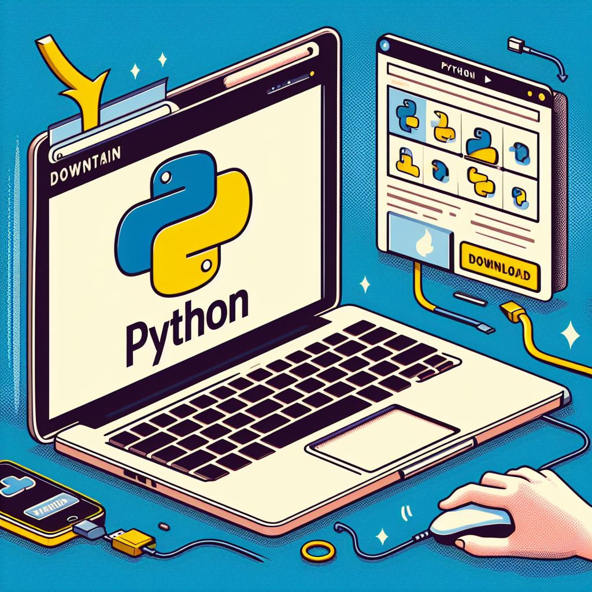

# Python-Basics-A-Comprehensive-Guide-for-Beginners

# Introduction
Python Basics: A Comprehensive Guide for Beginners

In the ever-evolving landscape of programming languages, Python stands out as a shining star. Its meteoric rise in popularity over the past two decades is nothing short of remarkable. Python has swiftly become the darling of programmers, data scientists, web developers, and professionals in various domains. Its simplicity and versatility have made it the go-to language for both beginners and seasoned developers. In this comprehensive guide, we will take you through the fundamental concepts of Python to help you embark on your programming journey.

### The Python Phenomenon
Python's ascent to prominence can be attributed to its readability and clean syntax. It's often hailed as one of the most beginner-friendly languages, making it an excellent choice for those new to programming. Python's extensive libraries and vast community support have further fueled its growth, making it the top choice for a wide range of applications, from web development and data analysis to artificial intelligence and scientific computing.

### Importance of Learning Python Basics
Learning Python basics is an essential step for anyone looking to enter the world of programming. These fundamentals serve as a strong foundation upon which you can build more advanced skills. Python's simplicity allows beginners to grasp key programming concepts, such as variables, data types, and control structures, without feeling overwhelmed. Moreover, Python is a language that bridges the gap between scripting and general-purpose programming, making it a versatile tool for various tasks. Whether you're a budding programmer, a data enthusiast, or a professional seeking to expand your skill set, mastering Python basics is a crucial first step. This guide will take you through the core principles of Python, providing you with the knowledge and confidence needed to embark on your coding journey. So, let's dive into the world of Python and unlock its vast potential.

# Python Basics Overview
Python is a high-level, general-purpose programming language that has gained immense popularity, especially among beginners in the world of coding. It is renowned for its simplicity, readability, and versatility, making it an ideal choice for those who are just starting their programming journey.

## Why Python is Popular Among Beginners
- **Readable and Understandable Code:** Python's syntax is clear, concise, and easy to read. It uses indentation to define code blocks, which enhances the code's readability. This feature reduces the learning curve and allows beginners to focus on solving problems rather than deciphering complex code.

- **Versatility:** Python can be used for a wide range of applications, from web development and data analysis to scientific computing and artificial intelligence. This versatility means that once you grasp the basics, you can explore various domains and find your niche in the programming world.

- **Strong Community Support:** Python has a vast and active community that is always ready to assist newcomers. This community-driven approach ensures that you can easily find resources, tutorials, and help whenever you encounter obstacles or have questions.

- **Extensive Libraries:** Python offers a rich ecosystem of libraries and frameworks that simplify complex tasks. This means that even beginners can leverage pre-built solutions to work on advanced projects, saving time and effort.

- **Cross-Platform Compatibility:** Python is compatible with various operating systems, making it accessible to a broad audience. Whether you're using Windows, macOS, or Linux, Python code will run consistently.

- **Career Opportunities:** Learning Python can open doors to a wide range of career opportunities. As businesses and industries increasingly rely on data-driven decision-making and automation, Python developers are in high demand.

- **In-Demand Skills:** Python is consistently ranked as one of the most in-demand programming languages in the job market. By mastering Python basics, you're setting yourself on a path to a thriving and rewarding career.

In summary, Python's popularity among beginners can be attributed to its simplicity, readability, and versatility. It is the ideal language for those starting their coding journey, offering a smooth transition into the world of programming while providing a solid foundation for tackling more advanced concepts. In the following sections of this guide, we will delve into the core concepts of Python and equip you with the knowledge and skills you need to become a proficient Python programmer.

# Setting up Python Environment for Beginners
Alright, let's dive into setting up your Python environment, especially designed for those who are just starting out with coding. We'll walk you through the basics: installing Python and choosing a code editor. It's all about simplicity and getting you up and running without any fuss.

## Installing Python
First things first, you need to install Python on your system. Python offers installation packages for various operating systems. Head over to the official Python website [Python Downloads](https://www.python.org/downloads/) and grab the latest stable version that suits your platform – whether you're on Windows, macOS, or Linux.

During installation, don't forget to tick the box that says "Add Python to PATH." It's a little checkbox that makes running Python from the command line a breeze.

## Choosing a Code Editor
Now that you've got Python on board, it's time to pick a code editor. For beginners, we recommend user-friendly options like Visual Studio Code, PyCharm, or Thonny. These editors offer a friendly, easy-to-navigate interface and some nifty features to make Python coding a joy. Download and install your chosen editor – this is where the magic begins.

## Writing and Running Python Code
With Python installed and your code editor ready, you can start writing and running Python code. Open your code editor, create a new Python script, and save it with a ".py" file extension (e.g., "my_script.py"). To run your code, open your command prompt or terminal, navigate to your script's directory, and execute it using this simple command:

  `python my_script.py`
  
There you have it! With these straightforward steps, you've set up your Python development environment, perfect for beginners. Python's user-friendly nature makes it an excellent choice for those new to coding. From crafting simple scripts to embarking on more ambitious projects like web development and data analysis, Python offers endless possibilities. So, welcome to the world of Python, and enjoy your coding adventure!

## Variables and Data Types: The Foundation of Python

Welcome to the heart of Python programming, where we delve into the fascinating world of variables and data types. In this section, you'll discover how these concepts are the bedrock of your Python programs. Think of them as the tools that allow you to store, manipulate, and process different types of information. We'll unravel the basics of data types, and how to declare variables, and we'll sprinkle in numerous examples and real-world use cases to make it all come alive.

### Understanding Basic Data Types

To begin our journey, let's imagine data types as the various flavors in an ice cream parlor. Python, as a language, serves up some of the most popular ones. Each of these data types is like a different ice cream flavor, ready to be scooped up and enjoyed:

1. **Integers (int):** Imagine integers as the whole numbers that line your street – they don't have any decimal parts. Integers are perfect for tasks like counting how many candies you have in your jar or tracking the number of books on a shelf.

2. **Strings (str):** Strings are like the strings of colorful holiday lights adorning your home. They are all about text, whether it's your name, an email address, or a message you want to convey to the world. Strings have you covered when it comes to handling and presenting text-based information.

3. **Floats (float):** Floats are like precision tools in your toolbox. When you need to work with numbers that include decimal points – think money, temperature readings, or scientific measurements – floats are your go-to data type.

4. **Booleans (bool):** Booleans can be compared to a light switch. They have only two possible states: on (True) or off (False). Booleans play a vital role in helping you make decisions and navigate the pathways within your code.

### Declaring Variables: The Foundation of Programming

Variables are like labels on containers where you store your data. When you declare a variable, you give that container a name, tell it what kind of data it's going to hold, and, just like that, it's ready to work its magic. In Python, declaring a variable is as simple as saying:

  `variable_name = value`
Here's a glimpse of how this works for each data type:

- **Integers (int):**
  `candies = 100`

- **Strings (str):** 
`message = "Hello, Python!"`

- **Floats (float):**
  `temperature = 27.5`

- **Booleans (bool):**

  `is_raining = False`

### Examples and Real-World Use Cases
Now, let's dive deeper into each data type with real-life examples and a peek into how you might use them in your Python programming journey.
1. **Integers (int):**
Integers are your trusty companions when you need to work with whole numbers. They excel at tasks like counting, indexing, and handling quantities. For instance:

  `apples_in_basket = 12`

Use Cases:
- Counting items, whether it's apples, cars, or any other quantity.
- Indexing elements in lists and strings.
- Representing ages, years, and similar whole-number values.

2. **Strings (str):**
Strings are like the words, sentences, and stories within your program. They are versatile and vital for various tasks, such as:

  `name = "Lucy"`

Use Cases:
- Storing names, addresses, or any text information.
- Formatting and processing text, such as in messaging applications.
- Reading and writing text to files.

3. **Floats (float):**
Floats are your trusted companions for precision numbers that involve decimal points. They find their application in various fields, such as:

  `price = 19.99`

Use Cases:
- Handling precise measurements, like money, weight, and temperature.
- Tackling complex mathematical tasks, from physics to financial calculations.
- Calculating ratios, percentages, and more.

4. **Booleans (bool):**
Booleans are your go-to decision-makers. They come in handy for steering your program's path and making choices. For instance:

  `is_weekend = True`

Use Cases:
- Making choices in your code, like deciding whether to take a day off.
- Checking if a user is logged in.
- Navigating through decision trees within your program's logic.

With these data types at your disposal and the art of variable declaration, you're well-equipped to craft a wide range of Python programs. These fundamental tools are your allies, whether you're creating simple scripts to automate tasks, diving into web development to build interactive websites, or exploring the depths of data analysis to derive insights from large datasets. So, welcome to the dynamic world of Python, where limitless possibilities await. Embark on this fantastic coding adventure, and watch your programming skills flourish! The journey has just begun, and the future holds endless opportunities for your coding endeavors.

## Operators and Expressions: Unleashing Python's Power
Welcome to the next exciting chapter in your Python adventure! In this segment, we're delving into the fascinating world of operators and expressions. These are like the magical tools that allow you to perform all sorts of incredible feats in your Python programs. Think of them as your Swiss Army knife, ready to slice, dice, and perform all kinds of tasks. We'll explore the fundamental operators – addition, subtraction, multiplication, division, and more – and show you their practical use in real-life scenarios.

### Basic Operators: The Building Blocks of Magic
In Python, operators are your trusty companions in this coding journey. They empower you to manipulate data, make comparisons, and carry out various operations. Here are the foundational operators you'll come across:
1. **Addition (+):**
 The addition operator brings numbers together and also helps concatenate strings.
2. **Subtraction (-):**
 It's your go-to for finding the difference between numbers.
3. **Multiplication (*):**
 The multiplication operator helps you create multiples of values or repeat strings.

4. **Division (/):**
 It divides numbers, providing you with quotients.
5. **Modulus (%):**
  The modulus operator reveals the remainder of a division.
6. **exponentiation**(**):
 It raises a number to a given power.
7. **Floor Division (//):**
 Floor division gives you the quotient without the remainder.

### Use Cases and Real-World Examples
Now, let's explore these operators by delving into real-life situations where you might use them.
1. **Addition (+)**
Think of this as a calculator for combining numbers and joining strings. Whether you're adding up costs or building strings of text, the addition operator plays a crucial role in Python.
Use Case: Adding Numbers
Example: If you have 10 apples and add 5 more, you have a total of 15.

2. **Subtraction (-)**
It's your tool for finding the difference between values, whether you're calculating expenses, measuring changes, or analyzing data.
Use Case: Finding the Difference
Example: If you had $20 and spent $7, you now have $13 left.

3. **Multiplication (*)**
This operator is like your personal cashier for calculating total costs, creating arrays, or even repeating strings.
Use Case: Calculating Total Cost
Example: If an item costs $5, and you buy 3 of them, the total cost is $15.

4. **Division (/)**
Division helps you find averages and divide things into portions. Whether you're splitting a bill or calculating rates, division is your go-to.
Use Case: Finding the Average
Example: If you have 21 cookies and want to share them equally among 3 friends, each gets 7 cookies.

5. **Modulus (%)**
Think of this operator as a detective, helping you find odd and even numbers, and even looping through arrays.
Use Case: Checking for Odd or Even
Example: If you divide 15 by 2, the remainder is 1, indicating that 15 is an odd number.

6. **Exponentiation (**)
This operator is like a superhero, raising numbers to the power of others. It's invaluable for tasks involving growth, decay, and more.
Use Case: Calculating Powers
Example: Two raised to the power of 3 equals 8.

7. **Floor Division (//)**
It's like a driver ensuring everyone gets an equal share, particularly when you're dividing quantities or lengths.
Use Case: Finding Quotient
Example: If you divide 25 by 4, the quotient is 6.

### Additional Operators: Assignment and Comparison

In addition to the basic operators, Python offers assignment operators to efficiently assign values to variables. Think of these as your post-it notes that help you keep track of things.

- **Assignment (=):** It's like naming your variables and giving them values. A friendly handshake between your variable and your data.

  `price = 10`

Python also boasts comparison operators to help you compare values, an essential skill in coding.
- **Equal (==):** Checks if two values are equals, the "is it a match?" operator.

  `is_equal = 5 == 5`

- **Not Equal (!=):** Helps you figure out when things don't match, the "spot the difference" operator.

  `is_not_equal = 10 != 7`

- **Greater Than (>):** This operator looks for the bigger fish in the pond, the "who's the boss?" operator.

  `greater = 20 > 15`

- **Less Than (<):** It's like the arbiter of smaller values, the "let's see who's shorter" operator.

  `less = 8 < 12`

These operators are invaluable when you need to make decisions in your code or compare data values to ensure they meet specific criteria.

## Practical Applications
Operators are used extensively in various programming scenarios. Some common applications include:
- Calculating mathematical equations and expressions.
- Comparing data values to make decisions in your code.
- Formatting and manipulating strings.
- Controlling loops and iterations in your code.
Operators are the gears that drive your Python programs, enabling you to perform a wide range of tasks. Whether you're building a simple calculator, analyzing data, or creating complex algorithms, a solid understanding of these operators is essential. So, as you embark on your coding adventure, remember that operators are your trusted companions, ready to assist you in your coding endeavors.

## Real-Life Applications
Operators find application in a multitude of real-life scenarios, both in programming and beyond. Here are some real-life applications:
1. Financial Calculations: Addition, subtraction, multiplication, and division are crucial in financial analysis, whether you're calculating compound interest, budgets, or investment returns.

2. Scientific Research: Exponentiation plays a pivotal role in scientific research. For instance, when calculating growth rates in a population or radioactive decay.
3. Data Analysis: Modulus operator is frequently used in data analysis to check for divisibility and looping through data sets.
4. Web Development: In web development, operators are used to concatenate strings, calculate responsive designs, and handle user interactions.
5. Game Development: In game development, operators are indispensable for calculating character movements, detecting collisions, and managing scores.
6. Machine Learning: Machine learning algorithms rely on operators for mathematical operations and comparing data points.
7. Graphic Design: Design software uses operators to transform and manipulate images, apply filters, and calculate color adjustments.
8. Everyday Life: Even in everyday life, operators are at play when you calculate tips, convert units, measure distances, and work with

